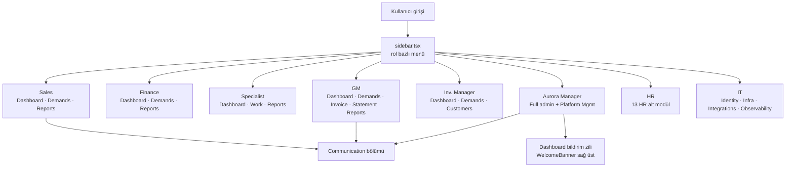
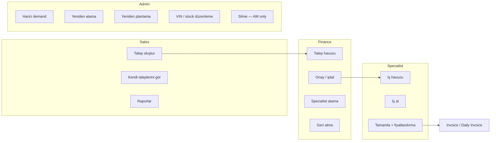
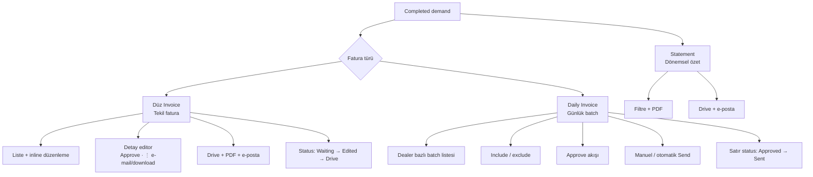
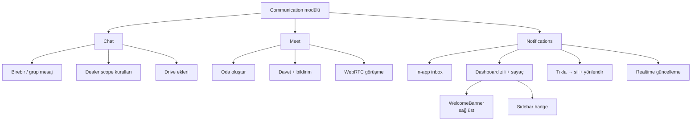
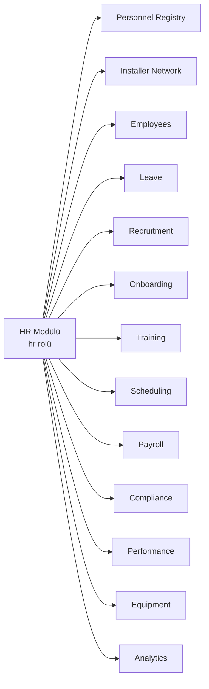
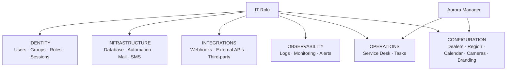
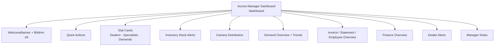
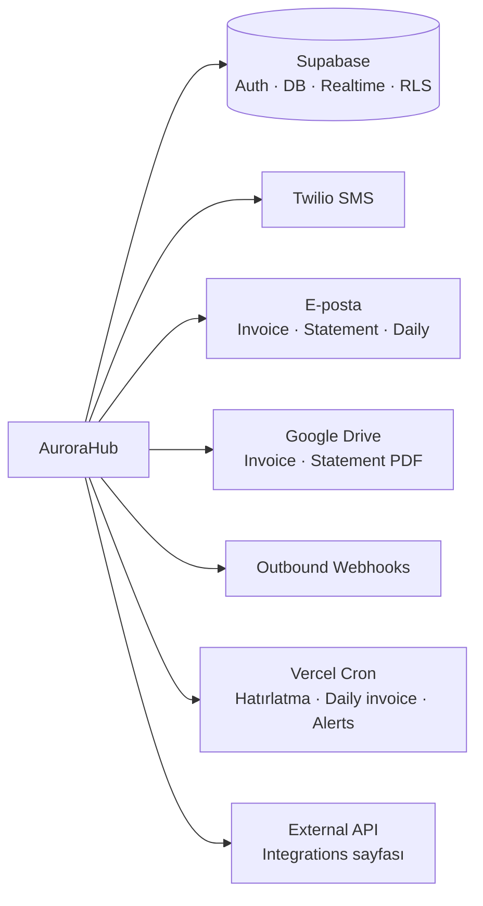

# AuroraHub — Özellik Akış Şemaları

> Görsel referans dosyası. Sistem koduna müdahale etmez.  
> Mermaid diyagramları GitHub, VS Code veya [mermaid.live](https://mermaid.live) ile görüntülenebilir.

---

## 1. Platform Genel Bakış

### Özellik haritası

```mermaid
flowchart TB
    AH[AuroraHub Platform]

    AH --> CORE[Çekirdek İş Akışları]
    AH --> ADMIN[Yönetim Modülleri]
    AH --> COMM[Communication]
    AH --> HR[İK Modülü]
    AH --> IT[IT / Sistem]
    AH --> SELF[Self Portal]

    CORE --> C1[Sales Demands]
    CORE --> C2[Finance Demands]
    CORE --> C3[Specialist Work]
    CORE --> C4[Admin Demands]

    ADMIN --> A1[Customers]
    ADMIN --> A2[Invoices]
    ADMIN --> A3[Daily Invoices]
    ADMIN --> A4[Statements]
    ADMIN --> A5[Inventory]
    ADMIN --> A6[Employees]
    ADMIN --> A7[Reports]

    COMM --> M1[Chat]
    COMM --> M2[Meet]
    COMM --> M3[Notifications]

    IT --> I1[Identity]
    IT --> I2[Infrastructure]
    IT --> I3[Integrations]
    IT --> I4[Observability]
    IT --> I5[Configuration]

    style AH fill:#C27E00,color:#fff
    style CORE fill:#fef3c7
    style ADMIN fill:#dbeafe
    style COMM fill:#dcfce7
```

### Modül özet tablosu

| Modül | Açıklama | Birincil roller | Ana route |
|-------|----------|-----------------|-----------|
| Dashboard | Rol bazlı ana sayfa, KPI, hızlı aksiyonlar | Tümü | `/dashboard` |
| Sales Demands | Talep oluşturma ve takip | Sales | `/dashboard/sales/demands` |
| Finance Demands | Onay, atama, iptal | Finance | `/dashboard/finance/demands` |
| Specialist Work | İş havuzu, kurulum tamamlama | Specialist | `/dashboard/specialist/work` |
| Admin Demands | Çapraz dealer talep yönetimi | AM, GM, Inv. Mgr | `/dashboard/admin/demands` |
| Invoices | Tamamlanan işlerden fatura | AM, GM | `/dashboard/admin/invoices` |
| Daily Invoices | Günlük toplu fatura gönderimi | Aurora Manager | `/dashboard/admin/daily-invoices` |
| Statements | Dealer hesap özeti | AM, GM | `/dashboard/admin/statements` |
| Communication | Chat, Meet, Bildirimler | Tümü | `/dashboard/communication/*` |
| HR | Personel, izin, işe alım | HR | `/dashboard/hr/*` |
| IT / System | Kimlik, altyapı, entegrasyon | IT, AM | `/dashboard/identity`, `/dashboard/configuration/*` |

---

## 2. Rol Bazlı Özellik Erişimi

### Akış şeması

### Rol — menü tablosu

| Rol | Sidebar ana linkler | Ek bölümler |
|-----|---------------------|-------------|
| **Sales** | Dashboard, Demands, Reports | Communication |
| **Finance** | Dashboard, Demands, Reports | Communication |
| **Specialist** | Dashboard, Work List, Reports | Communication |
| **General Manager** | Dashboard, Demands, Reports, Invoice, Statement | Communication |
| **Inventory Manager** | Dashboard, Demands, Customers | Communication |
| **Aurora Manager** | Dashboard, Demands, Reports, Employees, Customers, Invoice, Daily Invoices, Statement, Inventory, Service Desk, Leave | Platform Management + Communication |
| **HR** | Dashboard + 13 HR modülü | Communication |
| **IT** | Dashboard + Identity, Infrastructure, Integrations, Observability, Operations, Configuration | Communication |

---

## 3. Demand Yönetimi Özellikleri

### Özellik akışı

### Özellik detay tablosu

| Özellik | Açıklama | Roller | Route |
|---------|----------|--------|-------|
| Talep oluşturma | Randevu slotu, araç, kamera, müşteri | Sales, Finance | `/sales/demands/new`, `/finance/demands/new` |
| Finance onayı | Specialist otomatik atama, SMS | Finance | `/finance/demands` |
| İş tamamlama | service_type, invoice_total_amount | Specialist | `/specialist/work` |
| Harici demand | Geçmiş / dış kaynak iş | Aurora Manager | `/admin/demands` |
| Admin düzenleme | Atama, reschedule, notlar | AM, GM, Inv. Mgr | `/admin/demands/[id]` |
| Randevu hatırlatma | 24s / 4s SMS cron | Sistem | `/api/send-reminders` |
| Webhook olayları | demand_created, approved, completed | Sistem | `webhook-dispatch.ts` |

---

## 4. Fatura & Finans Özellikleri

### Özellik akışı

### Fatura özellik tablosu

| Özellik | Açıklama | Roller | Route | Öne çıkan UI |
|---------|----------|--------|-------|--------------|
| Invoice listesi | Tamamlanan işler, status dropdown | Aurora Manager | `/admin/invoices` | Waiting / Edited / Drive |
| Invoice detay | PDF önizleme, vergi, ek satırlar | AM (edit), GM (view) | `/admin/invoices/[id]` | Approve + ⋮ menü |
| Approve akışı | Save + Drive + onay + geri dönüş | Aurora Manager | Daily'den `?return=` ile | Otomatik 3 adım |
| Daily Invoices | PT gününe göre dealer batch | Aurora Manager | `/admin/daily-invoices` | Send modal, status Sent |
| Auto-send | 08:30 PT onaylı batch | Sistem cron | — | `daily-invoice-auto-send.ts` |
| Review notify | 21:00 PT inceleme bildirimi | Sistem → AM | — | Dashboard zili |
| Statement | Dealer dönem özeti PDF | AM, GM | `/admin/statements` | Tarih + dealer filtre |
| Realtime sync | Daily → Invoice tablo güncelleme | Sistem | — | `demands` realtime |

---

## 5. Communication Özellikleri

### Özellik akışı

### Communication özellik tablosu

| Özellik | Açıklama | Roller | Route |
|---------|----------|--------|-------|
| Chat | Mesajlaşma, dosya eki | Tümü (dealer scope) | `/communication/chat` |
| Meet | Video görüşme odaları | Tümü | `/communication/meet`, `/meet/[roomId]` |
| Notifications sayfası | Filtreli inbox, temizle | Tümü | `/communication/notifications` |
| Dashboard bildirim zili | Sayaçlı popover, son 12 bildirim | Tüm dashboard roller | WelcomeBanner |
| Realtime | Anlık bildirim + sayaç | Tümü | `comm_notifications` |
| SMS pending alert | SMS hatası → AM bildirimi | Aurora Manager | Otomatik |

---

## 6. HR Modülü Özellikleri

### Modül haritası

### HR alt modül tablosu

| Alt modül | Route | Açıklama |
|-----------|-------|----------|
| Personnel Registry | `/hr/personnel` | Çalışan / yüklenici kayıtları |
| Installer Network | `/hr/installers` | Kurulumcu ağı |
| Employees | `/hr/employees` | Platform çalışan dizini |
| Leave | `/hr/leave` | İzin talepleri (AM de onaylayabilir) |
| Recruitment | `/hr/recruitment` | Açık pozisyonlar |
| Onboarding | `/hr/onboarding` | İşe alım görevleri |
| Training | `/hr/training` | Eğitim programları |
| Scheduling | `/hr/scheduling` | Vardiya planlama |
| Payroll | `/hr/payroll` | Bordro |
| Compliance | `/hr/compliance` | Uyumluluk |
| Performance | `/hr/performance` | Performans değerlendirme |
| Equipment | `/hr/equipment` | Ekipman takibi |
| Analytics | `/hr/analytics` | İK metrikleri |

---

## 7. IT & Sistem Yönetimi Özellikleri

### Modül haritası

### IT / Platform özellik tablosu

| Bölüm | Özellikler | Route (yeni) | Legacy route |
|-------|------------|--------------|--------------|
| Identity | Kullanıcı, grup, rol, oturum | `/dashboard/identity/*` | — |
| Infrastructure | DB, otomasyon, mail, SMS | `/dashboard/infrastructure/*` | `/system-management/sms`, `/logs` |
| Integrations | Webhook, Google Drive, API | `/dashboard/integrations/*` | `/system-management/webhooks` |
| Observability | SMS/mail/demand logları, alert | `/dashboard/observability/*` | `/system-management/logs` |
| Operations | Service desk, görevler | `/dashboard/operations/*` | — |
| Configuration | Dealer, bölge, takvim, kamera | `/dashboard/configuration/*` | `/system-management/dealer`, `/region` |
| Service Desk | Ticket, incident, KB | `/operations/service-desk` | AM sidebar'da da var |

---

## 8. Dashboard & Widget Özellikleri

### Aurora Manager dashboard akışı

### Dashboard widget tablosu (Aurora Manager)

| Widget | İçerik | Anchor / route |
|--------|--------|----------------|
| Welcome Banner | Selamlama, tarih, bildirim zili | `#` üst |
| Quick Actions | Demand, Invoice, Finance, Statement… | Sayfa içi linkler |
| Stat Cards | Dealer, specialist, demand, completion | — |
| Inventory Stock Alerts | Düşük stok uyarıları | `#inventory-stock-alerts` |
| Camera Distribution | Kamera model dağılımı | — |
| Demand Overview | Pie chart + son talepler | `#demand-overview` |
| Demand Trends | Aylık trend, dealer karşılaştırma | — |
| Invoice Overview | Fatura durum özeti | — |
| Finance Overview | Finans KPI | `#finance-overview` |
| Dealer Alerts | Dealer uyarı widget | `#dealer-alerts` |
| Manager Notes | Notlar & hatırlatıcılar | `#manager-notes` |

---

## 9. Entegrasyon & Altyapı Özellikleri

### Entegrasyon akışı

### Entegrasyon tablosu

| Entegrasyon | Kullanım alanı | Yapılandırma |
|-------------|----------------|--------------|
| Supabase Auth | Giriş, oturum, RLS | Ortam değişkenleri |
| Supabase Realtime | Chat, bildirim, invoice sync | Migration publications |
| Twilio | Onay, iptal, hatırlatma SMS | `/infrastructure/sms` |
| E-posta | Fatura, statement, daily batch | `/infrastructure/mail` |
| Google Drive | Invoice / statement PDF arşiv | `/integrations/external-apis` |
| Webhooks | Demand lifecycle olayları | `/integrations/webhooks` |
| Vercel Cron | 6 zamanlanmış job | `vercel.json` |

---

## 10. Self Portal & Müşteri Özellikleri

### Self portal tablosu

| Özellik | Açıklama | Kullanıcı | Route |
|---------|----------|-----------|-------|
| Self Portal | İzin, bordro, ekipman, sertifika | Platform staff (`dealer_id = null`) | `/dashboard/self` |
| Customer Portal | Müşteri tarafı (auth dışı) | Müşteri | `/customer-portal` |
| Admin Customers | Demand kaynaklı müşteri dizini | AM, Inv. Mgr | `/admin/customers` |
| Customer SMS | Müşteriye SMS (Inv. Mgr hariç) | AM | Customers detay |

---

*Son güncelleme: AuroraHub mevcut kod tabanına göre hazırlanmıştır.*
