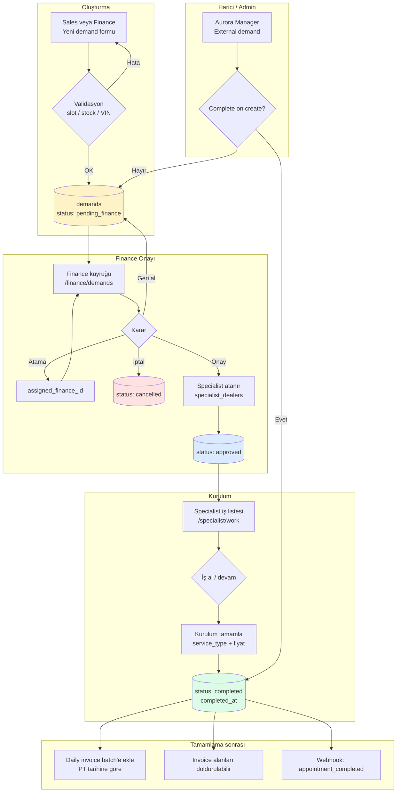
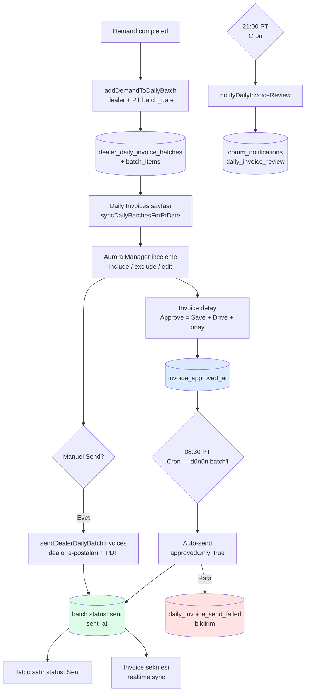
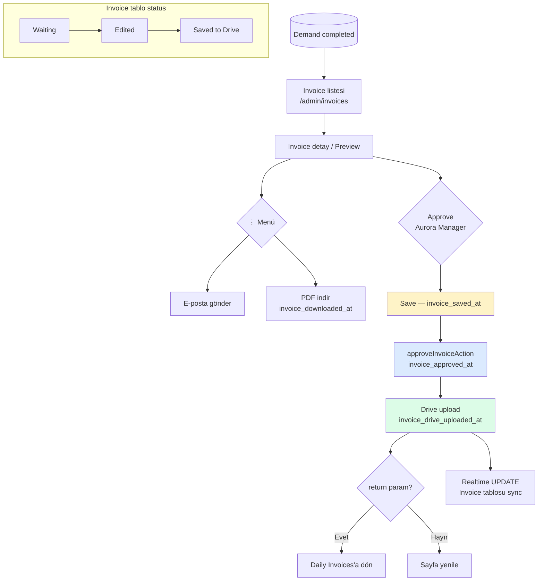
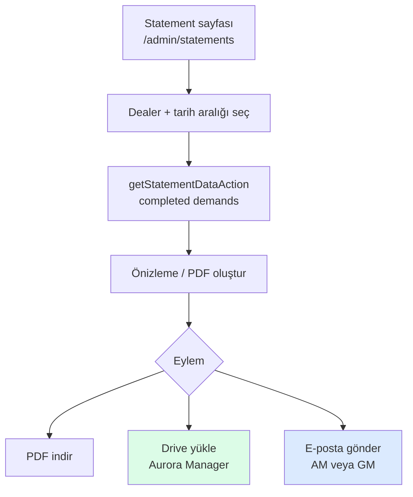
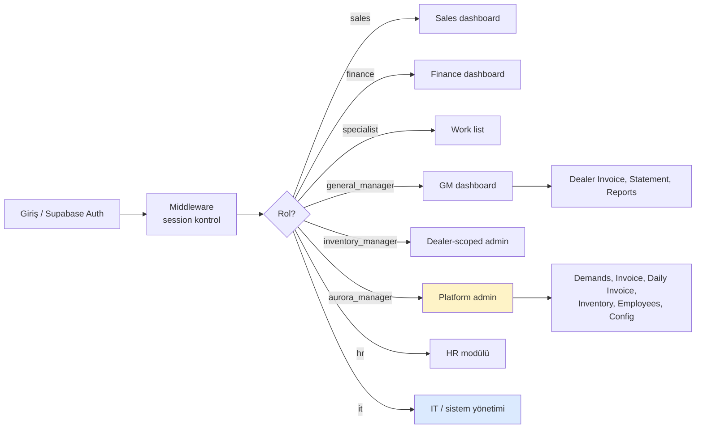
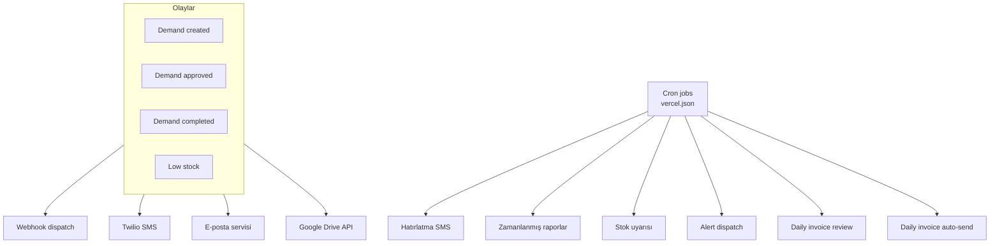

# AuroraHub — Workflow Akış Şemaları

> Görsel referans dosyası. Sistem koduna müdahale etmez.  
> Mermaid diyagramları GitHub, VS Code veya [mermaid.live](https://mermaid.live) ile görüntülenebilir.

---

## 1. Demand (Talep) Yaşam Döngüsü

### Akış şeması



### Adım tablosu

| Adım | Durum | Aktör | Aksiyon | Route / Dosya |
|:----:|-------|-------|---------|---------------|
| 1 | `pending_finance` | Sales / Finance | Demand oluştur | `/dashboard/sales/demands/new`, `/dashboard/finance/demands/new` |
| 2 | `pending_finance` | Finance | Kendine ata | `finance/demands/actions.ts` |
| 3 | `approved` | Finance | Onayla + specialist ata | `/dashboard/finance/demands` |
| 4 | `approved` | Specialist | İşi al / tamamla | `/dashboard/specialist/work` |
| 5 | `completed` | Specialist | Kurulum bitir | `specialist/work/actions.ts` → `addDemandToDailyBatch` |
| — | `cancelled` | Finance | İptal | SMS + webhook |
| — | `pending_finance` | Finance | Onayı geri al | `revertDemandToPending` |
| — | `completed` | Aurora Manager | Harici demand | `/dashboard/admin/demands` (external) |

### Otomatik hatırlatmalar (Cron)

| Zamanlama | API | Açıklama |
|-----------|-----|----------|
| Saatlik | `/api/send-reminders` | Onaylı randevulara 24s / 4s SMS hatırlatması |

---

## 2. Daily Invoice Workflow

### Akış şeması



### Adım tablosu

| Adım | Aktör | Koşul | Sonuç | Route / Dosya |
|:----:|-------|-------|-------|---------------|
| 1 | Sistem | Demand `completed` | Batch item eklenir | `daily-dealer-invoices.ts` |
| 2 | Aurora Manager | Sayfa açılışı | Eksik item'lar senkronize | `/dashboard/admin/daily-invoices` |
| 3 | Cron (21:00 PT) | Batch var | İnceleme bildirimi | `/api/daily-invoice-review-notify` |
| 4 | Aurora Manager | Invoice düzenle | Approve → kaydet + Drive + onay | `/dashboard/admin/invoices/[id]?return=...` |
| 5 | Aurora Manager | Manuel Send | Toplu PDF e-posta | `daily-invoices/actions.ts` |
| 6 | Cron (08:30 PT) | Önceki PT günü, onaylı | Otomatik gönderim | `/api/daily-invoice-auto-send` |
| 7 | Sistem | Gönderim OK | Batch `sent`, satırlar **Sent** | `send-dealer-daily-batch-invoices.ts` |

### Cron tablosu

| Schedule (UTC cron) | Route | Etkin saat (PT) | İşlev |
|---------------------|-------|-----------------|-------|
| `0 * * * *` | `/api/daily-invoice-review-notify` | 21:00 | İnceleme bildirimi |
| `30 * * * *` | `/api/daily-invoice-auto-send` | 08:30 | Dünün onaylı batch'lerini gönder |

---

## 3. Invoice (Düz Fatura) Workflow

### Akış şeması



### Adım tablosu

| Adım | Aktör | Aksiyon | DB alanı | Yetki |
|:----:|-------|---------|----------|-------|
| 1 | AM / GM | Listele / filtrele | — | AM: tüm dealer, GM: kendi dealer |
| 2 | Aurora Manager | Alan düzenle + kaydet | `invoice_saved_at` | AM only |
| 3 | Aurora Manager | Approve (tek tık) | Save + `invoice_approved_at` + Drive | AM only |
| 4 | AM / GM | PDF indir | `invoice_downloaded_at` | AM + GM |
| 5 | Aurora Manager | E-posta (⋮ menü) | mail log | AM only |
| 6 | Aurora Manager | Drive (Approve içinde otomatik) | `invoice_drive_uploaded_at` | AM only |

---

## 4. Statement Workflow

### Akış şeması



### Adım tablosu

| Adım | Aktör | Aksiyon | Yetki |
|:----:|-------|---------|-------|
| 1 | AM / GM | Dealer ve dönem filtrele | GM: kendi dealer kilitli |
| 2 | AM / GM | Statement verisi yükle | Tamamlanmış demand'ler |
| 3 | AM / GM | PDF önizle / indir | Her ikisi |
| 4 | Aurora Manager | Google Drive'a yükle | AM only |
| 5 | AM / GM | E-posta ile gönder | Her ikisi |

---

## 5. Bildirim (Notification) Workflow

### Akış şeması

```mermaid
flowchart TD
    subgraph SOURCES["Bildirim kaynakları"]
        S1[Chat mesajı]
        S2[Meet davet / başlangıç]
        S3[SMS gönderilemedi]
        S4[Daily invoice review — 21:00 PT]
        S5[Daily invoice send failed — 08:30 PT]
    end

    SOURCES --> DB[(comm_notifications)]
    DB --> RT[Supabase Realtime]
    RT --> BELL[Dashboard zili + sidebar badge]
    RT --> PAGE[/communication/notifications]

    BELL --> CLICK{Tıkla}
    PAGE --> CLICK
    CLICK --> DEL[deleteNotificationAction]
    DEL --> NAV[İlgili sayfaya git<br/>chat / meet / daily-invoices]

    style DEL fill:#fee2e2
    style NAV fill:#dcfce7
```

### Bildirim türleri tablosu

| Tür | Tetikleyici | Hedef kullanıcı | Yönlendirme |
|-----|-------------|-----------------|-------------|
| `chat_message` | Yeni mesaj | Konuşma üyeleri | `/communication/chat?c=...` |
| `mention` | Bahsetme | İlgili kullanıcı | Chat |
| `meet_invite` | Davet | Davetliler | Meet odası (yeni sekme) |
| `meet_started` | Meet başladı | Katılımcılar | Meet odası |
| `sms_pending` | SMS hatası | Aurora Manager | Notifications |
| `daily_invoice_review` | 21:00 PT cron | Aurora Manager | Daily Invoices link |
| `daily_invoice_send_failed` | Auto-send hata | Aurora Manager | Daily Invoices link |

---

## 6. Rol & Yetki Workflow (Özet)

### Akış şeması



### Rol — yetki matrisi (özet)

| Yetenek | Sales | Finance | Specialist | GM | Inv. Mgr | Aurora Mgr | HR | IT |
|---------|:-----:|:-------:|:----------:|:--:|:--------:|:------------:|:--:|:--:|
| Demand oluştur | ✓ | ✓ | — | — | — | External | — | — |
| Demand onayla | — | ✓ | — | — | — | Override | — | — |
| Kurulum tamamla | — | — | ✓ | — | — | — | — | — |
| Invoice düzenle / onayla | — | — | — | Görüntüle | — | ✓ | — | — |
| Daily invoice | — | — | — | — | — | ✓ | — | — |
| Statement | — | — | — | ✓ | — | ✓ | — | — |
| Platform config | — | — | — | — | — | ✓ | — | ✓ |
| Communication | ✓ | ✓ | ✓ | ✓ | ✓ | ✓ | ✓ | ✓ |

---

## 7. Entegrasyon & Otomasyon Workflow

### Akış şeması



### Cron tablosu (tüm sistem)

| Schedule | Route | Açıklama |
|----------|-------|----------|
| `0 * * * *` | `/api/send-reminders` | Randevu SMS hatırlatmaları |
| `0 * * * *` | `/api/send-scheduled-reports` | Zamanlanmış rapor e-postaları |
| `0 9 * * *` | `/api/check-low-stock` | Düşük stok kontrolü |
| `*/15 * * * *` | `/api/run-alerts` | Alert kuralları |
| `0 * * * *` | `/api/daily-invoice-review-notify` | 21:00 PT — daily invoice inceleme |
| `30 * * * *` | `/api/daily-invoice-auto-send` | 08:30 PT — otomatik gönderim |

---

*Son güncelleme: AuroraHub mevcut kod tabanına göre hazırlanmıştır.*
